# ☄️ Meteor Madness by team Kosmos
# 🚀 NASA SpaceApps Challenge 2025
Innovative solutions for space exploration and meteor studies  
---

## ✅ Project deliverables

* [WebApp](https://kosmos-meteor-madness-0.streamlit.app/) (*...wait for the app to load...* ⌛)
*   
* [Download the video MP4 file](SPACEAPPS_2025/spaceapps2025_meteor-madness-video-intro_alphaKosmosTeam.mp4)
* [Download the PPT Slides](SPACEAPPS_2025/spaceapps2025-meteor-madness-intro-slides_KosmosTeam.pptx)

---

## 🎯 Objectives
- Understand the threat posed by Near-Earth Objects (NEOs) by developing models simulating a meteor impact.
- Assess potential damage and human vulnerability.
- Explore mitigation strategies for planetary defense.
- Promote education through interactive and engaging tools.
- Explain complex scientific models and theories in plain language.

---

## ☄️ Entry and Impact Severity Modeling
- Modeled atmospheric entry dynamics: **velocity, angle, density, drop point**.
- Seven types of effects modeled:
  - Eventual break-up and airburst
  - Crater formation and ejecta deposits
  - Thermal radiation and fireball radius
  - Blast overpressure
  - Wind intensity
  - Seismic activity created
  - Eventual tsunami
- Vulgarization: raw data transformed to facilitate understanding and visualization.

**High-Level Entry Impacts Modeling (ARMOR)**

```mermaid
flowchart TD
  A["Asteroid enters atmosphere"] --> B{"Break Up altitude<br/>Above ground?"}
  B -->|Yes| C["Asteroid breaks up<br/>in mid air"]
  B -->|No| F["Asteroid reaches<br/>surface"]

  C --> D{"Airburst altitude<br/>Above ground?"}
  D -->|Yes| E["Asteroid experiences<br/>Airburst"]
  D -->|No| J["Asteroid fragments<br/>impact ground"]

  %% Both routes go through the same water/ground decision
  F --> G{"Water impact?"}
  J --> G

  G -->|Yes| H["(Fragments of) Asteroid<br/>impacts Ocean"]
  G -->|No| I["(Fragments of) Asteroid<br/>impacts solid ground"]

  %% Effects regrouped
  EC["Common Effects<br/>• Overpressure<br/>• High Winds<br/>• Thermal Radiation"]
  EOS["Ocean-Specific Effects<br/>• Tsunami"]
  EGS["Ground-Specific Effects<br/>• Final Crater Size<br/>• Ejecta Blanket<br/>• Seismic Shock"]

  %% Connections to effects
  E --> EC
  H --> EC
  H --> EOS
  I --> EC
  I --> EGS 
```

Source : ARMOR 2017 + authors

---

## 📊 Vulnerability and Casualty Modeling
- Depends on the severity of the effect.
- Calculated using **ARMOR (2017)** and **PAIR (2024) insights**.
- Allows creation of areas of casualty rate by combining severity and vulnerability.

---

## 🛡️ Mitigation Modeling & Planetary Defense
- Explored deflection strategies, such as **kinetic impactors** and **gravity tractor**.
- Interactive approach: users can try sending an impactor or a gravity tractor on a meteor and see the effect on its orbit. --> **VERY LIMITED VISUAL EFFECT GIVEN SIMULATION SIZE** 

---

## 🎉 Why It’s Fun and Didactic
- Combines science, coding, and creativity.
- Stimulates the user as they actively participate in the learning process.
- Vulgarization work to **democratize the phenomenon**.

