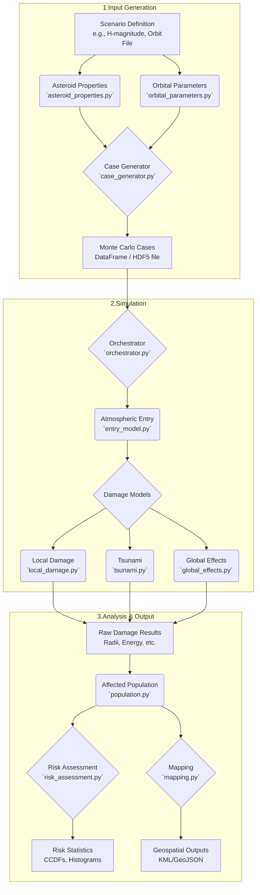

# Data Flow and Modeling Pipeline

The `PyPAIR` simulation follows a sequential, modular pipeline that transforms initial uncertainties into final risk products. This flow is managed by the `Orchestrator` class in `src/pair_model/core/orchestrator.py`.

1.  **Input Generation**:
    -   The process starts with high-level scenario parameters (e.g., an asteroid's absolute magnitude `H` and a file of possible trajectories).
    -   The **`AsteroidPropertyGenerator`** samples millions of property sets (diameter, density, strength, etc.) based on statistical distributions described in the paper.
    -   The **`OrbitalParameters`** module loads the entry points (latitude, longitude, velocity, angle).
    -   The **`CaseGenerator`** combines these into a comprehensive set of unique impact cases, which are stored efficiently (e.g., in a Pandas DataFrame or an HDF5 file).

2.  **Simulation**:
    -   The **`Orchestrator`** iterates through each case. For performance, this step should be parallelized.
    -   For each case, the **`entry_model`** (FCM) is called to calculate the atmospheric breakup, determining the effective burst altitude and any remaining surface impact energy.
    -   Based on the entry results, the relevant **`damage_models`** are invoked to calculate the extent of each hazard (e.g., blast radius, thermal radius, tsunami run-up height).

3.  **Analysis and Output**:
    -   The raw damage results (e.g., damage radii) are passed to the **`population`** module, which uses gridded population data to estimate the number of people affected for each hazard and severity level.
    -   The **`risk_assessment`** module aggregates the "affected population" data from all cases to generate the final statistical products: probability distributions, exceedance curves (CCDFs), and summary tables.
    -   The **`mapping`** module uses the damage footprints from all cases to compute and export geospatial files, such as a KML file showing the 95th percentile damage risk swath.